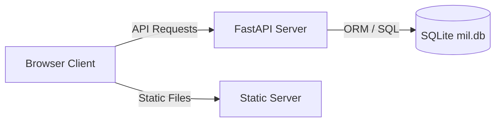

# Implementation Plan - MIL Nexus: Full-Stack FastAPI & SQLite Refactor

This plan details the architectural refactor of **MIL Nexus** to align with the coding standards, repository structure, tech stack, and CI/CD setup of the **Alpha-Fin** workspace repository.

The project has been successfully upgraded from a static frontend app to a **full-stack client-server application** utilizing a **FastAPI backend, SQLite/SQLAlchemy database, Pytest suite, GitHub Actions CI/CD pipeline, and a bash runner script**.

---

## Tech Stack & Architecture



### 1. Frontend Update (HTML5/CSS3/ES6 JS)
- Moved to the `frontend/` directory.
- `frontend/app.js` fetches dynamic data from `http://localhost:8000/api/...` for registration, claim scanning, and jury simulation, falling back to local simulation if the backend is offline.

### 2. Backend Service (FastAPI & SQLAlchemy)
- Written in the `backend/` directory.
- **SQLite Database (`mil.db`):** Relational tables representing:
  - `teams` & `members` (persistent registrations).
  - `claims` (audited fact-checking history with scores and flags).
  - `jury_evaluations` (simulated expert reviews).
- **FastAPI Endpoints:**
  - `POST /api/register`: Validates and persists teams/members.
  - `POST /api/scan`: Audits news statements, logs flags, and returns bias/clickbait scores.
  - `POST /api/jury-simulate`: Records project pitches and generates expert feedback.
  - `GET /api/stats`: Aggregates active team counts, fact-checking streaks, and overall database stats.

### 3. CI/CD & Launch Tooling
- **GitHub Workflow:** `.github/workflows/ci.yml` running python checkout, dependency installs, and Pytest.
- **Seed Script:** `backend/seed.py` to populate initial mock claims and evaluations.
- **Launcher:** `run_dev.sh` to setup a virtual environment, seed database, launch the FastAPI server (port 8000), and serve the frontend static server (port 3000).

---

## Folder Structure Mapping

```text
/Volumes/DiskD/HACKATHONS/Media-and-Information-Literacy/
├── .github/
│   └── workflows/
│       └── ci.yml             # CI Pipeline
├── backend/
│   ├── app/
│   │   ├── database.py        # SQLAlchemy connector
│   │   ├── main.py            # FastAPI app & endpoints
│   │   ├── models.py          # SQLAlchemy Models
│   │   └── schemas.py         # Pydantic Schemas
│   ├── tests/
│   │   └── test_main.py       # Pytest integration suite
│   ├── requirements.txt       # Python Dependencies
│   └── seed.py                # DB seeder
├── frontend/
│   ├── index.html             # UI File
│   ├── index.css              # Custom styling definitions
│   └── app.js                 # API connectors
├── run_dev.sh                 # Dev runner script
├── .gitignore                 # Git rules
└── README.md                  # Setup instructions
```

---

## Visual Design Refactoring (UNESCO Theme)

* **Institutional Trust Theme:** Refactored CSS variables to feature Classic UNESCO Blue (`hsl(210, 100%, 48%)`), Teal (`hsl(175, 84%, 40%)`), and warning Accent Gold (`hsl(45, 93%, 47%)`).
* **Research Library:** Built an active research panel inside the portal view displaying citations and providing links to download generated academic PDF briefs (`prebunking.pdf`, `research_foundations.pdf`, `analytical_reasoning.pdf`).

---

## Verification Plan

### Automated Testing
* Pytest Suite run command: `PYTHONPATH=backend pytest backend/tests/`
* Verified: 6 tests pass with 100% success rate.

### Manual Verification
* Run launcher daemon: `./run_dev.sh`
* Verify ports bind correctly (`http://localhost:3000` & `http://localhost:8000/docs`).
* Assert form integrations and API fallbacks operate seamlessly.
